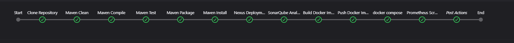
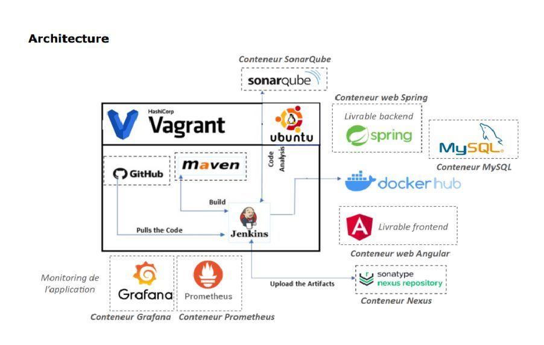

# DevOps Project

This project demonstrates the implementation of DevOps practices to optimize the development lifecycle of an application. The primary tools and concepts used include:

- **Jenkins**: A continuous integration server to automate build and testing for every code change.
- **Docker**: Containerization to ensure the portability of the application across different environments.
- **Git**: Version control for tracking changes to the source code.
- **Nexus**: A repository manager to store and distribute application artifacts.
- **SonarQube**: A code quality tool to continuously evaluate and improve the codebase.
- **Grafana and Prometheus**: Real-time monitoring and visualization solutions to track performance metrics.
- **JUnit and Mockito**: Unit testing and mocking frameworks to validate business logic and isolated behaviors, ensuring code reliability.
- **GitHub Runner**: To achieve automatic triggering of the CI/CD pipeline on push.

This project aims to establish a streamlined, automated, and monitored DevOps pipeline to enhance development efficiency and software quality.

---

## Key Features

- **Continuous Integration/Continuous Deployment (CI/CD)**: Automatically builds, tests, and deploys the application.
- **Code Quality Assurance**: Ensures clean and maintainable code using SonarQube.
- **Artifact Management**: Stores and manages deliverables with Nexus.
- **Real-Time Monitoring**: Tracks application performance using Grafana and Prometheus.
- **Portability**: Deploys consistent environments with Docker.

---

## Screenshots

### Jenkins Pipeline Screenshot

### Architecture Diagram

---

## Architecture Overview

The architecture integrates multiple tools to streamline the DevOps pipeline:

1. **Source Code Management**:

   - **GitHub**: Stores the source code.
   - **Jenkins**: Automates builds and testing on every push.

2. **Build and Quality Analysis**:

   - **Maven**: Handles build processes.
   - **SonarQube**: Performs code quality checks.

3. **Containerization and Artifact Management**:

   - **Docker**: Containerizes backend and frontend applications.
   - **Nexus**: Stores application artifacts.

4. **Application Deployment**:

   - **Spring**: Backend service.
   - **MySQL**: Database service.

5. **Monitoring and Visualization**:
   - **Prometheus**: Collects performance metrics.
   - **Grafana**: Provides real-time visualizations.

---

## How to Run

1. Clone the repository from GitHub.
2. Set up the required tools (Jenkins, Docker, SonarQube, Nexus, Prometheus, Grafana).
3. Configure the Jenkins pipeline to pull the code and trigger builds.
4. Use Docker to containerize the application components.
5. Deploy the containers to your preferred environment(DockerHub in my case).
6. Monitor application performance through Grafana dashboards.
---
